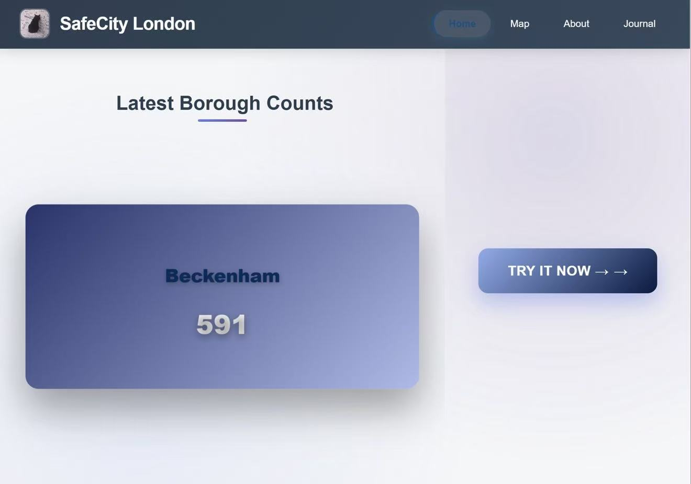

# SafeCity London

SafeCity London is a public safety information platform based on London crime data, designed to help residents and visitors better understand urban safety conditions through visualization and interactive analysis.




## Project Overview

SafeCity London was created by a team of London students concerned about urban safety. The platform transforms complex police crime data into clear, intuitive visual information. Through color-coded maps and interactive charts, users can:

- Quickly view safety levels across London boroughs
- Conduct in-depth analysis of crime trends in specific areas
- Customize safety queries based on personal needs

## Features

### 🗺️ Borough Crime Map
- Color-coded London borough map
- Real-time crime data visualization
- Click to view detailed statistics

### 📊 Interactive Data Analysis
- Multi-dimensional filtering (borough, crime type, time period)
- Trend charts and statistical analysis
- Personalized safety planning tools

### 📱 Mobile-First Design
- Responsive layout for all devices
- Clean and intuitive user interface
- Diverse and engaging interactive designs

## Technical Architecture

- **Frontend**: HTML5, CSS3, JavaScript
- **Backend**: Node.js
- **Data Source**: [UK Police Official API](https://data.police.uk/api/)
- **Visualization**: D3.js, TopoJSON
- **Maps**: SVG vector graphics

## Quick Start

### Method 1: Run Node Server (Recommended for Development)

1. Ensure Node.js is installed
2. Navigate to the `ce_survivors` folder in terminal
3. Run the following command:
   ```bash
   node back-end/server.js
4.Open http://localhost:3000 in your browser

### Method 2: Direct Website Access
[Website link to be added]   

## Project Structure
ce_survivors/
├── back-end/           # Backend server code
│   ├── server.js      # Main server file
│   ├── db.js          # Database configuration
│   └── package.json   # Dependencies configuration
├── front-end/          # Frontend static files
│   ├── css/           # Stylesheets
│   ├── js/            # JavaScript scripts
│   ├── images/        # Image resources
│   └── *.html         # Page files
└── README.md          # Project documentation

## Pages Overview
## Home Page (index.html)
Borough crime data carousel display

Quick access to map page

Responsive card layout design

## Map Page (map.html)
London borough crime heatmap

Color-coded safety level display

Click boroughs for detailed information

## About Page (about.html)
Project background and team introduction

Detailed feature descriptions

User guide and instructions

## Journal Page (journal.html)
Project development history

Version update records

Technical evolution documentation

## Key Files（need edited）
## Backend Files
server.js - Main HTTP server with API endpoints

db.js - MySQL database configuration and queries

package.json - Project dependencies

## Frontend Files
style.css - Global styles and header

home.css - Homepage specific styles

map.css - Map page styles

carousel.js - Borough data carousel

map-visualization.js - D3 map rendering

## Data Source
All crime data is sourced from the UK Police Official API, ensuring data accuracy and timeliness. Data is automatically updated every 15 minutes.

## Development Team
Annie Zhu - GitHub: Annie-Zhu1210 | zcakxz4@ucl.ac.uk

Ethan Taylor - GitHub: ethan-se | ethan.taylor.20@ucl.ac.uk

Xinyi Zhang - GitHub: CynthiaZHANGovo | ucfnxz3@ucl.ac.uk

Yifei Huang - GitHub: Freyafff666 | ucfnuaw@ucl.ac.uk

## Media Resources

## Images to be Uploaded
Website screenshots

Team photos

Data visualization examples

## Videos to be Uploaded
Website feature demonstration video

User tutorial video

Technical architecture explanation video

## API Endpoints
Endpoint	Method	Description	Query Parameters
/api/borough-latest	GET	Latest crime counts for all boroughs	-
/api/boroughs/crime-totals	GET	Crime totals with category filtering	category, date
/api/boroughs/{id}/trend	GET	Crime trend data for specific borough	months, category
/api/crime-months	GET	Available crime data months	-
/api/crime-types	GET	List of crime categories	-


## Maintenance & Support
If you find bugs or have feature suggestions, please submit them via GitHub Issues. For styling customization questions, feel free to start a discussion in GitHub Discussions.


<div align="center">
https://img.shields.io/badge/Node.js-43853D?style=for-the-badge&logo=node.js&logoColor=white
https://img.shields.io/badge/JavaScript-F7DF1E?style=for-the-badge&logo=javascript&logoColor=black
https://img.shields.io/badge/HTML5-E34F26?style=for-the-badge&logo=html5&logoColor=white
https://img.shields.io/badge/CSS3-1572B6?style=for-the-badge&logo=css3&logoColor=white

https://img.shields.io/github/stars/your-username/safecity-london?style=social
https://img.shields.io/github/forks/your-username/safecity-london?style=social

Made with ❤️ for Londoners' Safety

</div> 
