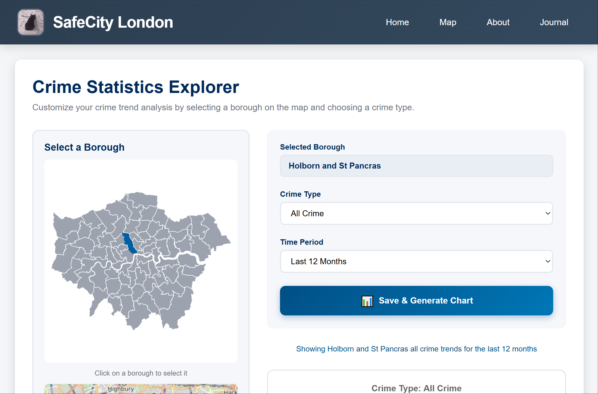
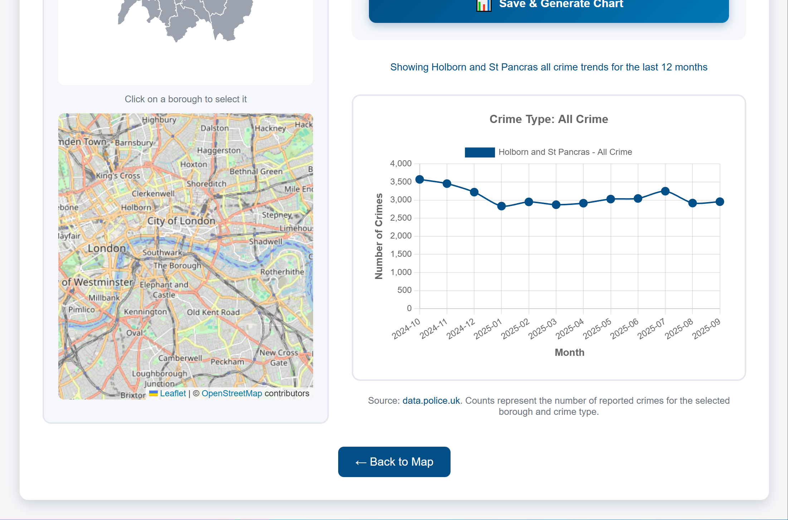
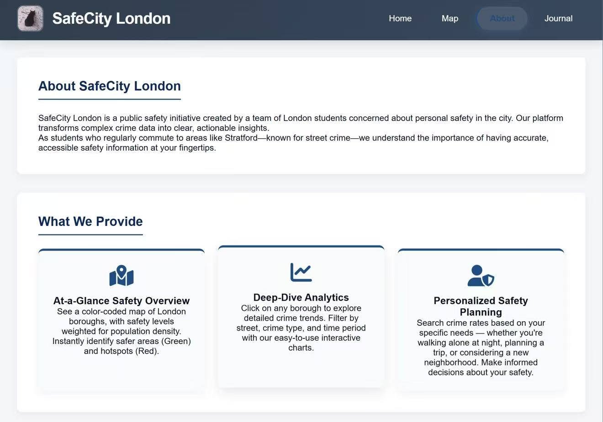
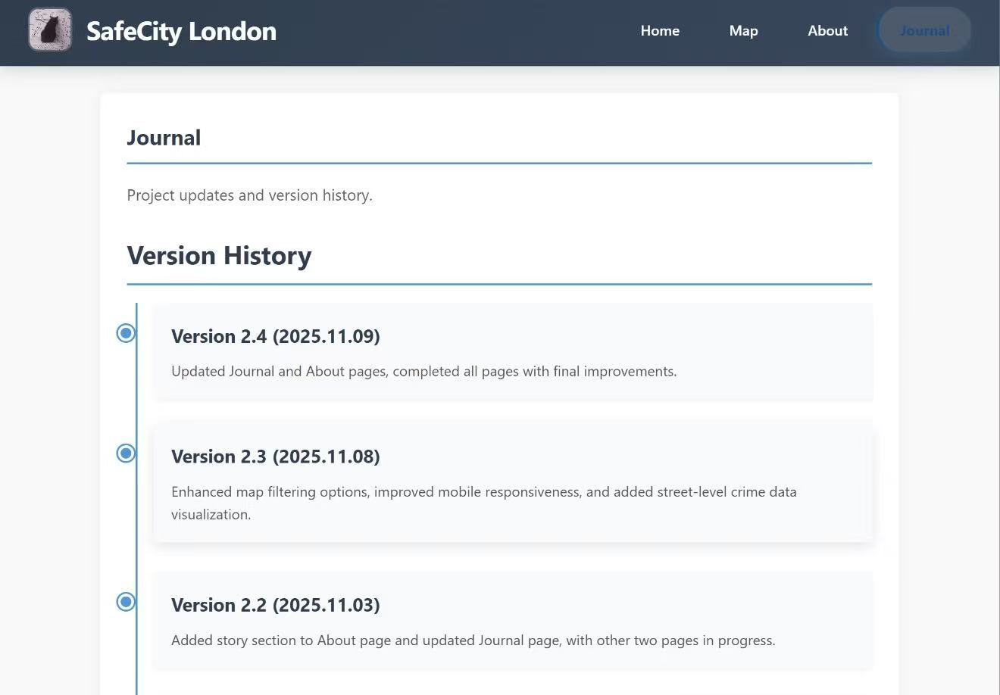

# SafeCity London

SafeCity London is a public safety information platform based on London crime data, designed to help residents and visitors better understand urban safety conditions through visualization and interactive analysis.


## Project Overview

SafeCity London was created by a team of London students concerned about urban safety. The platform transforms complex police crime data into clear, intuitive visual information. 

Through color-coded maps and interactive charts, users can:

- Quickly view safety levels across London boroughs
  
- Conduct in-depth analysis of crime trends in specific areas
  
- Customize safety queries based on personal needs

## Features

### 🗺️ Borough Crime Map
- Color-coded London borough map
- Real-time crime data visualization
- Click to view detailed statistics

### 📊 Interactive Data Analysis
- Multi-dimensional filtering (borough, crime type, time period)
- Trend charts and statistical analysis
- Personalized safety planning tools

### 📱 Mobile-First Design
- Responsive layout for all devices
- Clean and intuitive user interface
- Diverse and engaging interactive designs

## Technical Architecture

- **Frontend**: HTML, CSS, JavaScript
- **Visualization**: D3.js, TopoJSON, chart.js
- **Backend**: Node.js
- **Data Managment**: MySQL, db.js, jquery
- **Data Source**: [UK Police Official API](https://data.police.uk/api/)
- **Maps**: SVG vector graphics, leaflet

## Quick Start

### Method 1: Run Node Server (Recommended for Development)

1. Ensure Node.js is installed
2. Navigate to the `ce_survivors` folder in terminal
3. Run the following command:
   ```bash
   node back-end/server.js
4.Open http://localhost:3000 in your browser

### Method 2: Direct Website Access (edited)
[Website link to be added]   


## Pages Overview
### Home Page (index.html)
Borough crime data carousel display

Quick access to map page

Responsive card layout design

### Map Page (map.html)
London borough crime heatmap

Color-coded safety level display

Click boroughs for detailed information


### Statistics Page (Statistics.html)
Interactive crime trend analysis platform

Custom borough selection with map interface

Multi-dimensional filtering by crime type and time period

Real-time interactive line charts showing crime trends



### About Page (about.html)
Project background and team introduction

Detailed feature descriptions

User guide and instructions



### Journal Page (journal.html)
Project development history

Version update records

Technical evolution documentation




## Data Source
All crime data is sourced from the UK Police Official API, ensuring data accuracy and timeliness. Data is automatically updated every 15 minutes.

## Development Team
Annie Zhu - GitHub: Annie-Zhu1210 | zcakxz4@ucl.ac.uk

Ethan Taylor - GitHub: ethan-se | ethan.taylor.20@ucl.ac.uk

Xinyi Zhang - GitHub: CynthiaZHANGovo | ucfnxz3@ucl.ac.uk

Yifei Huang - GitHub: Freyafff666 | ucfnuaw@ucl.ac.uk

## Videos Resources (edited）
<div align="center">


[](https://www.youtube.com/watch?v=IAvDoEs-CeU)

<small>Click to watch story demo </small>

</div>


## Maintenance & Support
If you find bugs or have feature suggestions, please submit them via GitHub Issues. For styling customization questions, feel free to start a discussion in GitHub Discussions.


<div align="center">

Made with ❤️ for Londoners' Safety

</div> 
